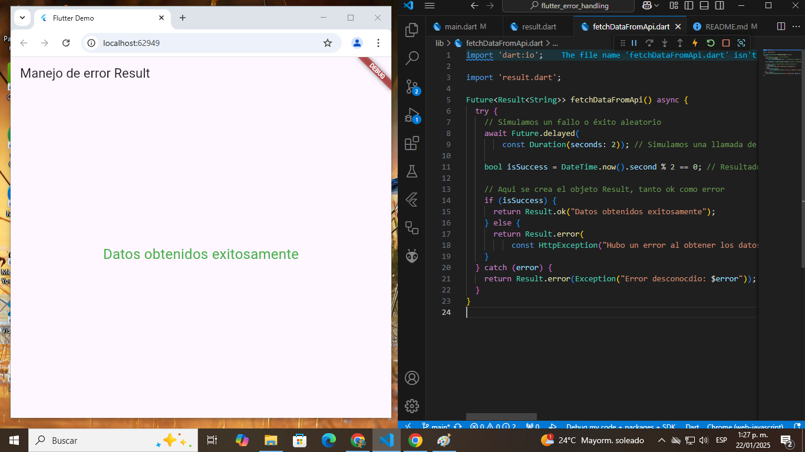

# 🚀 Flutter Learning Project

[](https://flutter.dev)

[](LICENSE)



## 📚 Descripción

Este es un proyecto de aprendizaje creado con Flutter para entender el manejo de errores utilizando el patrón `Result`. Este patrón se utiliza para representar los resultados de una operación que puede tener éxito o fallar, simplificando el flujo de control y la gestión de excepciones.

## 🎯 Objetivo del Proyecto

- Aprender y aplicar el patrón `Result` en Flutter.
- Practicar la gestión de errores de forma controlada.
- Implementar un flujo de control que devuelva un resultado exitoso o un error utilizando las clases `Ok` y `Error`.

## 🛠️ Características

- **Patrón Result**: Manejo explícito de resultados con éxito o error.
- **UI con FutureBuilder**: Interfaz reactiva que muestra el resultado de la operación.
- **Simulación de API**: Función que simula una operación de red con resultados aleatorios.

## 📂 Estructura del Proyecto

```plaintext
lib/
├── main.dart           # Punto de entrada de la app
├── fetchDataFromApi.dart  # Función que simula una operación de red
├── result.dart         # Definición de las clases Result, Ok, Error
```

## 🚀 Cómo Ejecutar el Proyecto

1. Asegúrate de tener Flutter instalado en tu sistema. Si no, sigue las instrucciones en la [documentación oficial](https://flutter.dev/)

2. Clona este repositorio:

```bash
git clone https://github.com/BastianNaitsab/flutter_error_handling
```

3. Navega al directorio:

```bash
cd flutter_error_handling
```

4. Instala las dependencias:

```bash
flutter pub get
```

5. Ejecuta la aplicación:

```bash
flutter run
```

## 🧰 Herramientas Usadas

- **Flutter SDK:** Framework
- **Dart:** Lenguaje de Programacion
- **VS Code:** Entorno de Desarrollo
- **Android Studio:** Emulador

## 📖 Lo que He Aprendido

- 🌟 Implementación del patrón Result para mejorar el manejo de errores.

## 🤝 Contribuciones

Este proyecto es principalmente para aprendizaje personal, pero siéntete libre de proponer mejoras o sugerencias.

## 📞 Contacto
Bastian Naitsab - [devmentesacontacto@gmail.com](mailto:devmentesacontacto@gmail.com)  
GitHub: [BastianNaitsab](https://github.com/BastianNaitsab)